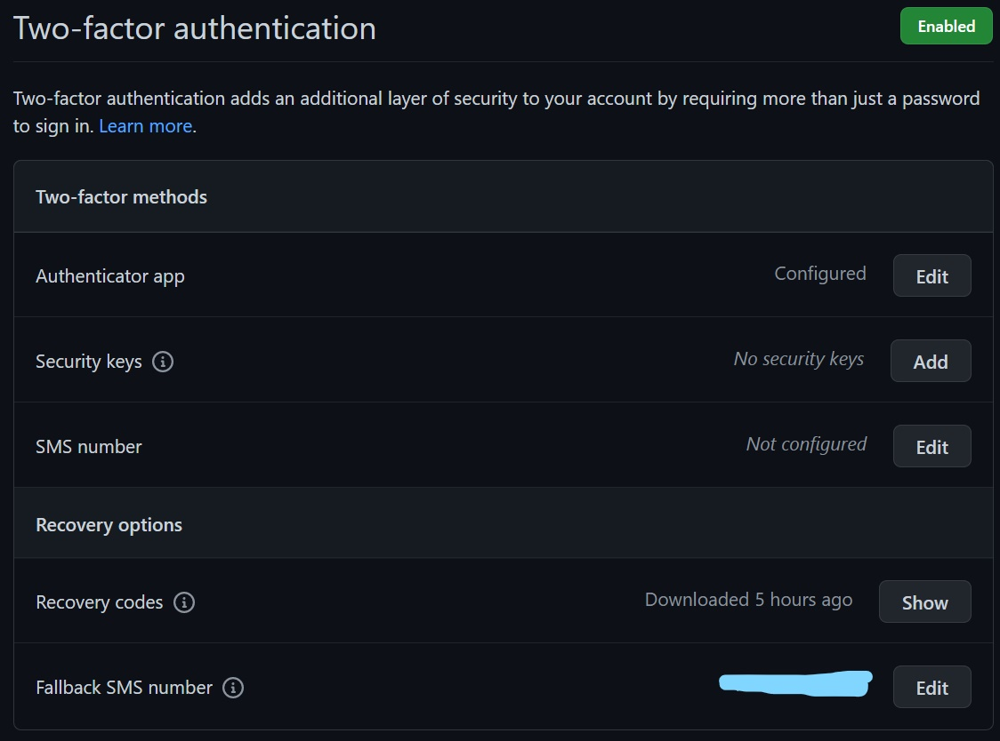

# Hito 0 - Milestone 0
This document is employed by the student to explain and describe the specific steps the student was taking to obtain the result presented in the integrated version.

## Paso 1 - Step 1
The student created a Github account and configured it following the instructions given by the professor.
This includes:

- the creation of an SSH key pair
- the addition of the student's name and email addresses (so future commits can be attributed to a specific account/person)
- the use of an individualised profile picture
- the addition of name, surname, visible email addresses, city and university to the account
- the use of a two-factor authentication
- the installation of gh

In the following these will be shown, described and possible questions will be answered.

### The creation of an SSH key pair

An SSH key pair was created and added to the account.

### The addition of name, surname, (visible) email adresses, city and university and the use of an individualised profile picture

The student's name and surname, email addresses, city, university and individualised profile picture were added to the account.

### The use of a two-factor authentication

The student employed two-factor authentication as described in the exercise sheet.

## The installation of gh

gh has been installed to enable to use of Github commanded through the Commandline.
